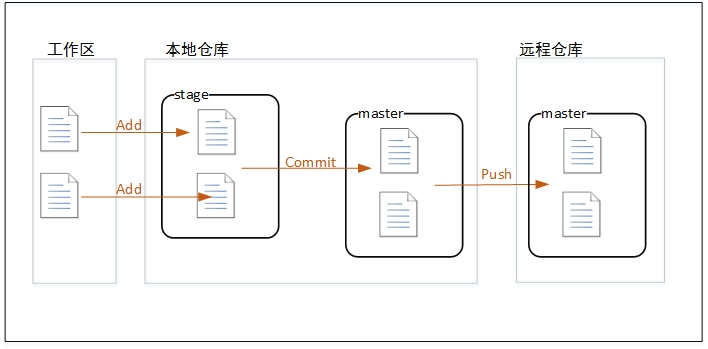

#### 拉项目代码

在磁盘新建文件夹，右键`git bash` ，执行命令 `git clone ssh地址`，从远程拉下代码

#### 新建本地分支

点击idea右下角，点击`new branch` ,可以新建本地分支

#### 新建远程分支

在本地服务器gitlab网站上新建远程分支

#### 切换到本地分支

点击要切换的分支，再点击弹出菜单的`checkout`

#### 从远程分支拉代码

在项目名称上右击

#### 向远程分支提交代码

#### 将远程分支和远程主分支合并

选择要合并的分支，在右上角提交合并申请，待管理员同意后，就合并成功了

#### 使用git stash保存和恢复进度

有些不想commit的改动可以用`stash`保存，之后可以用`unstash`恢复

保存当前工作进度，会把暂存区和工作区的改动保存起来。执行完这个命令后，在运行`git status`命令，就会发现当前是一个干净的工作区，没有任何改动 

